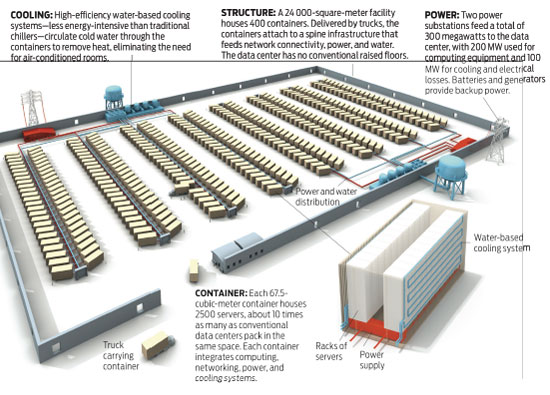

## Nuage





## CAPEX vs OPEX
- Capital Expenses
- Operation Expenses

## Qu'est ce que le "cloud" public?
- Les 5 principes
  * Pooled Resources (Available to any users) 
  * Virtualization
  * Elasticity (Dynamic scale without CAPEX)
  * Automation (Build, configure, ... without manual intervention)
  * Metered Billing (Pay per use)
     
- Les classifications

  * SaaS (Software as a Service)
  * FaaS (Function as a Service) ou Serverless
  * BaaS (Backend as a Service) [Obsolete]
  * PaaS (Platform as a Serice)
  - µS (Mesos DCOS or VmWare VSphere)
  * IaaS (Infrastructure as a Service)

  Temps d'installation
  * FaaS (en minutes)
  * PaaS (en heures)
  * µS (en semaines)
  * IaaS (en mois)

  - Examples
     * SaaS: 
       Prezi, Google Docs, Microsoft 365, 
       
     * FaaS:  
       AWS Lamda, Google Cloud Functions, Zapier, IFTTT
       
       http://cloudacademy.com/blog/google-cloud-functions-serverless/

     * BaaS:   
       Firebase, adMob
       
       https://github.com/NativeScript/sample-Groceries

     * PaaS:
       Google App Engine, IBM SmartCloud, EngineYard, Heroku, AppScale, CloudFoundry (VMWare)

     * µS:  
       Apache Mesos (créer une Structure Spark)

     * IaaS:  
       AWS, Microsoft Azure, RackSpace, DigitalOcean, OpenNebula, CloudSigma, OracleCloud, TheIntercloud (dead Cisco cloud)

# Devoir:  

* Nuage Public et Privé   
```
  1) Exercice: Chercher des Nuages Gratuits
```
  * HP Entreprise Converged Infrastructure [Gary]   
  * Google Compute Engine* [Gary]  
  * IBM SmartCloud entreprise* [Gary]  
  * Microsoft Azure TryOut [Julien]  
  * Julien a chercher   
```
  2) Exercice: Faire la demonstration d'un Cloud 
  * 30 minutes max
  * lancer une instance de son choix
  * si IaaS se connecter a son instance d'un Terminal Local
  * si PaaS demontrer qu'il est vivant
  * Lister les services offerts (i.e. DNS, VM, Object Store, DB)
  Du Lundi 30 Janvier
```
  

## Nuage Public
- AWS (Amazon Web Services)
- Azure (Microsoft)

## Nuage Privé

OpenStack en production
- Keystone
- Nova
- Neutron
- Cinder

