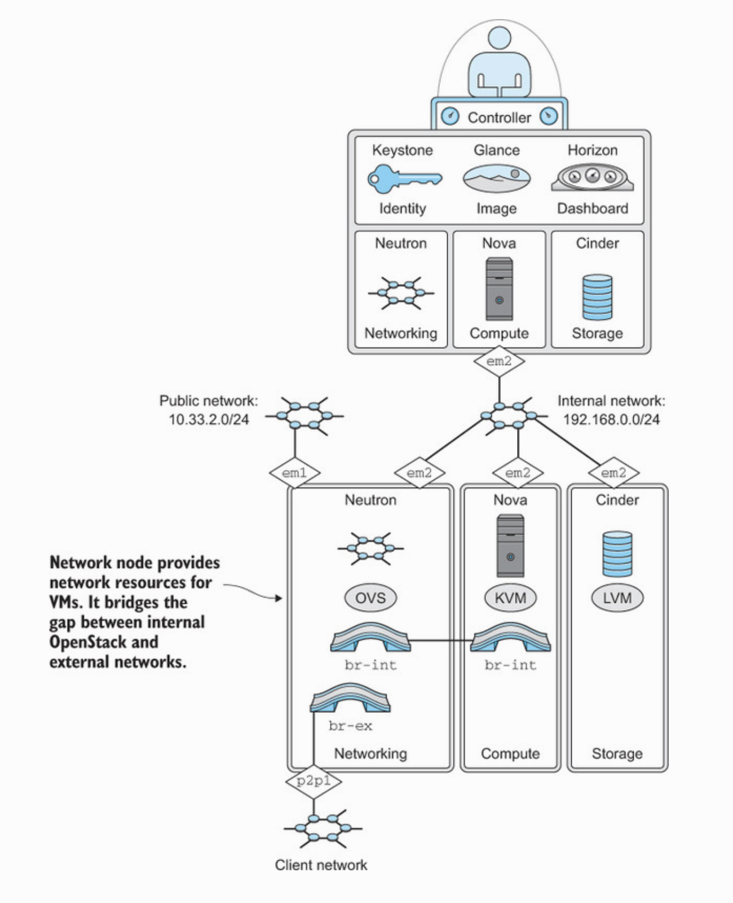
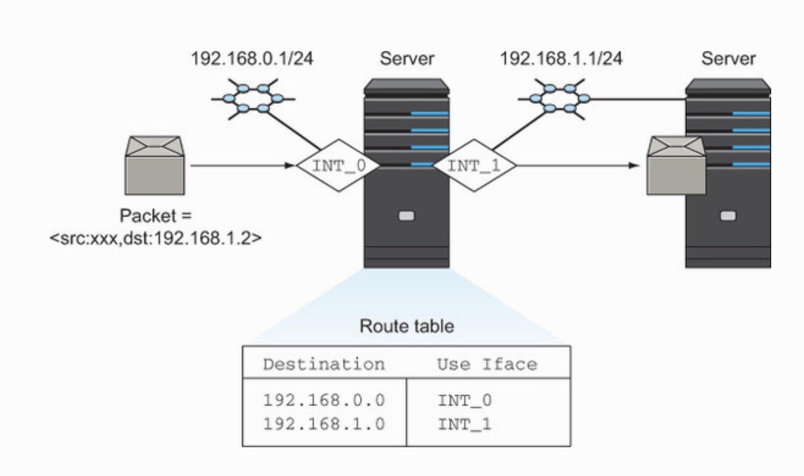
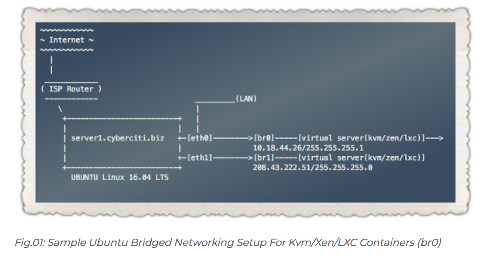
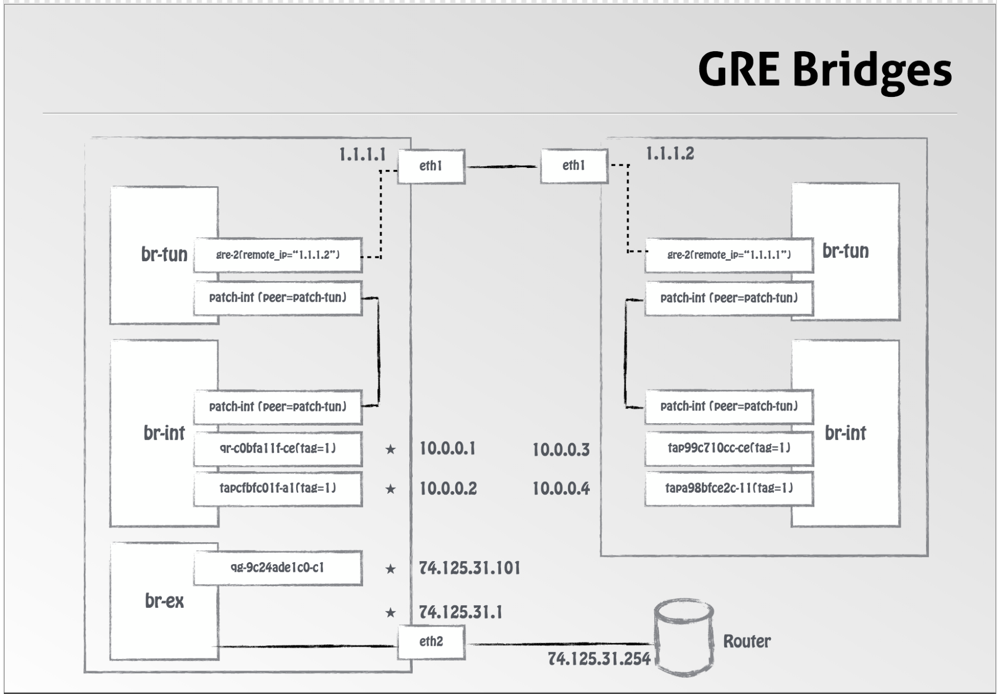

## Solution pour sortir Openstack de la machine devstack:

### Ouvrir le noyau

### Ouvrir le firewall
```
$ sudo iptables -t nat -A POSTROUTING -s 10.13.237.48/28 -j MASQUERADE
```

### Ouvrir le chemin
```
$ sudo iptables -t nat -A POSTROUTING -s 10.13.237.80/28 -j MASQUERADE
```


## Neutron 

* Quick overview



## [0.KVM](./0.KVM)

* Modify the kernel to allow the routing of traffic between interfaces



### [1.Bridging](./1.Bridging)

* Setting up bridges critical to the operation of OpenStack networking



### [2.OpenVswitch](./2.Open-vSwitch)

* What virtual switch is used in OpenSTack?




### [3.NetNS](./3.NetNS)

* How to use NameSpaces to create separate tenant environments ?


### [4.p2p](./4.p2p)

# References:

## Networking

hub vs Bridge vs Switch
https://www.youtube.com/watch?v=Xmwmezk75Tk

